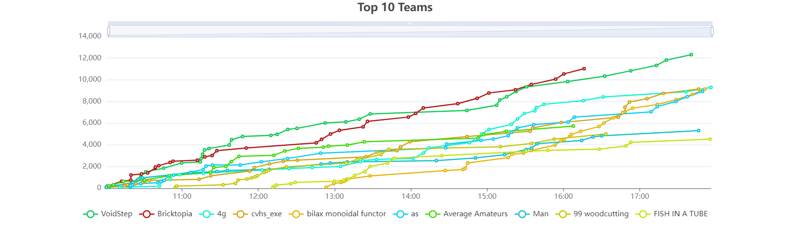

# Some Capture the Flag Competitions I've Participated in:

## FallCTF (Texas A&M University)
* Team: 4g
* Ranked: 3rd (/49)
* 

## PicoCTF 2024
* Team: [apple haters](https://play.picoctf.org/teams/11162)
* Ranked: 20th US Middle/High School 

## HSCTF 10
* Team: apple haters
* Ranked: 5th US Middle/High School, top 2% globally

## PicoCTF 2023
* Team: [apple haters](https://play.picoctf.org/teams/6243)
* Ranked: 38th US Middle/High School 

# Other CyberSecurity Competitions

## AFA CyberPatriot XV
* Team: 15-5102 
* Ranked: [2nd](https://www.uscyberpatriot.org/Documents/Scores/Protected%201417%202%20Feb%202023%20CP-XV%20SF%20Published%20Scores%20Final.xlsx) in Division Semifinals (MCJROTC)
